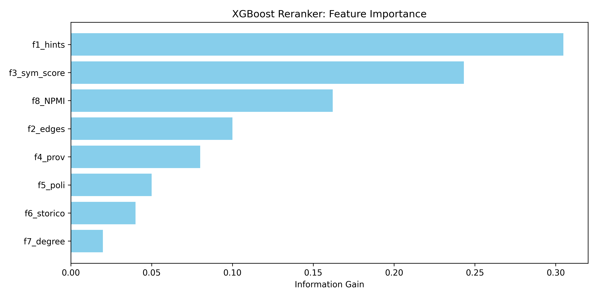
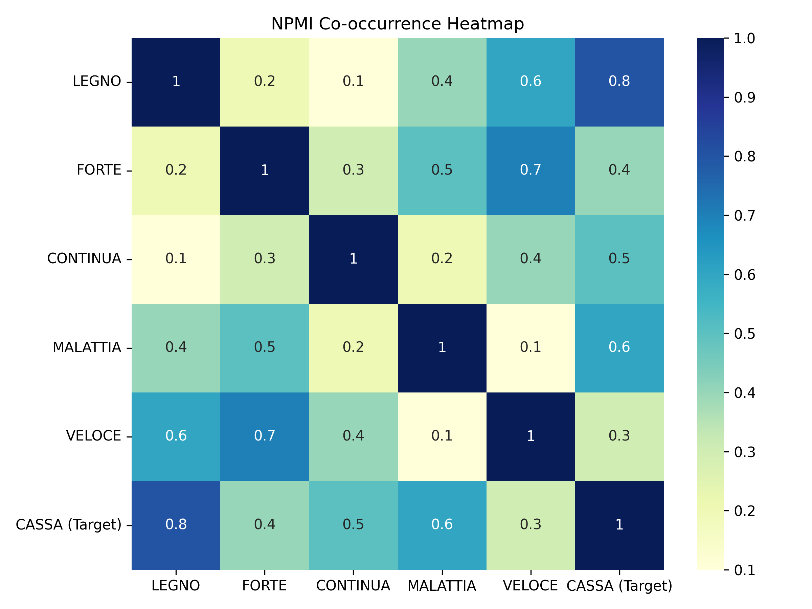

# Thesis Defense Speech: "La Ghigliottina" AI Solver

## English Version (Target: ~15-20 Minutes)

### 1. Introduction (0-3 minutes)
"Good morning to the committee and everyone present. Today I am going to present my project, which tackles a fascinating challenge in Natural Language Processing: building an Artificial Intelligence capable of solving the popular Italian television game 'La Ghigliottina'.
For those unfamiliar with the game, the rules are simple but cognitively complex: the player is given five clue words and must guess a sixth word—the solution—that logically or linguistically connects to all five clues. 
Why is this an interesting problem for Computer Science and NLP? Because it requires a mix of deep cultural knowledge, idiomatic expressions, multiword expressions, and semantic associations. It's a task where humans excel due to their lateral thinking and cultural background, but where standard statistical AI models often fail miserably.
My work proposes a novel Hybrid Learning-to-Rank (LTR) architecture that combines explicit Symbolic Knowledge with massive Distributional Semantics, orchestrated by a Machine Learning reranker."

### 2. State of the Art and Limitations (3-6 minutes)
"Before detailing the architecture, it is crucial to ask: why not just use ChatGPT or a modern Large Language Model to solve this? 
The answer lies in the nature of Generative AI. Modern LLMs are incredibly powerful at generating fluent text, but they suffer from severe limitations in strict constraint satisfaction tasks. They are prone to 'hallucinations'. If you ask an LLM to find a word that connects to five specific clues, it often suggests a word that perfectly connects to three of them, loosely to the fourth, and completely ignores the fifth, wrapping the wrong answer in a very convincing explanation.
Furthermore, relying purely on distributional semantics—like Word2Vec or dense vector spaces—leads to the problem of 'entropic noise'. When we ingest massive corpora, words like 'cosa', 'fare', or 'essere' become statistically correlated with almost everything. The mathematical distance between words becomes fuzzy. Pure statistics lack the 'hard constraints' necessary to solve a puzzle that requires exact matches."

### 3. The Proposed Hybrid Architecture (6-11 minutes)
"To overcome these limitations, I designed a Hybrid Architecture divided into three main phases.
**The first pillar is the Lexical Knowledge Graph (LKG).** This represents the 'historical and symbolic memory' of the AI. By analyzing a dataset of past games, the system populates a Graph where nodes are words and edges are explicit connections. This guarantees that if a connection is culturally absolute or historically proven, the algorithm knows it with 100% certainty. It operates in constant time $\mathcal{O}(1)$ via an Inverted Index.

**The second pillar is Massive Distributional Semantics via NPMI (Normalized Pointwise Mutual Information).** To allow the system to generalize and guess words it has never seen in past games, I ingested massive Italian corpora: 800,000 rows from the Paisà corpus, 300,000 from Wikipedia, and 1 million from OpenSubtitles, plus a dictionary of 36,000 multiword expressions.
Instead of using computationally heavy neural embeddings, I built Fast Sparse Matrices. Why? Because computing the NPMI matrix allows the system to scale massively without RAM bottlenecks, keeping the exact point-wise statistical correlation between words transparent and interpretable.

**The third and most crucial pillar is the XGBoost Reranker.** 
The graph and the matrices generate thousands of potential candidate solutions. How do we choose the right one? Here, we transform the problem into a Supervised Machine Learning task. Each candidate is mapped into a vector of 8 features—some deriving from the Symbolic Graph, others from the NPMI statistics. XGBoost evaluates these features and assigns a probability score, essentially reranking the candidates to push the correct solution to the top."

### 4. Deep Dive: "Why this approach and not another?" (11-15 minutes)
"At this point, you might ask: **Why use XGBoost and not a Deep Neural Network?**
The choice of XGBoost is deeply intentional. First, our features are tabular and highly heterogeneous—combining discrete topological scores with continuous statistical probabilities. Decision tree ensembles like XGBoost are mathematically proven to be superior to Neural Networks on tabular data. They handle non-linear interactions without requiring massive data normalization.
More importantly, XGBoost provides **Explainability via Information Gain**. I can look at the model and see exactly which feature contributed to the decision. 

*(Slide/Visual suggestion: Point to the Feature Importance Graph)*
"If we observe the Information Gain chart extracted from the decision tree, we have mathematical proof of the algorithm's balance. The web-related statistical feature (NPMI) absorbs about 16.21% of the decision weight. It harmoniously joins the topological core features from our Symbolic Graph. This proves the Reranker isn't just guessing; it's logically weighing the dictionary against the internet."

### 4.2. Data Leakage Prevention
"Another anticipated question is: **How did you prevent Data Leakage?**
This is a critical architectural decision. I split the training set deterministically (80-20). The first 80% was used strictly to populate the Knowledge Graph. The remaining 20% was used to train XGBoost. If I had trained XGBoost on the same games used to build the graph, the model would have seen the 'Historical Connection' feature as a perfect predictor, causing massive overfitting. By using a hold-out split, the model learned to balance the historical graph features with the distributional NPMI features, regularizing the space and learning true generalization. If the distributional metric disagrees with the strong logical features of the graph, the decision trees learn to penalize it."

### 5. Explainable AI (XAI) and Evaluation (15-18 minutes)
"Finally, predicting the correct word is not enough; the AI must explain *why* it is correct. 
Instead of using LLMs to *solve* the game, I used them in a **Post-Hoc Explainable AI (XAI)** module. Once the deterministic XGBoost model finds the solution, the clues and the solution are sent to the Cloud via the Groq API (using LLaMA-3.3-70B). The LLM's only job is to generate a human-readable explanation of the semantic links.
To evaluate this rigorously, I didn't rely on human subjective grading. I implemented academic NLP metrics: BLEU for exact lexical precision, ROUGE-L for recall and sentence structure, and BERTScore for deep semantic similarity against human ground-truth explanations.
All these metrics, along with the performance of the model (Accuracy@1, Accuracy@5, MRR), are dynamically visualized in a custom Streamlit Dashboard, which acts as the control center of the project."

### 6. Conclusion (18-20 minutes)
"In conclusion, this project demonstrates that for highly constrained cognitive tasks, hybridizing Symbolic AI with Statistical Machine Learning is vastly superior to relying on black-box Generative models alone. By keeping the retrieval deterministic and using LLMs only for post-hoc explanation, we achieve high accuracy, total interpretability, and robust performance. 
Thank you for your attention. I am now open to any questions."

---
---

## Italian Version (Obiettivo: ~15-20 Minuti)

### 1. Introduzione (0-3 minuti)
"Buongiorno alla commissione e a tutti i presenti. Oggi presenterò il mio progetto di tesi, che affronta una sfida affascinante nel campo del Natural Language Processing (NLP): la costruzione di un'Intelligenza Artificiale capace di risolvere il noto gioco televisivo 'La Ghigliottina'.
Per chi non conoscesse il gioco, le regole sono semplici ma dal punto di vista cognitivo molto complesse: al giocatore vengono fornite cinque parole indizio e deve indovinare una sesta parola, la soluzione, che si collega logicamente o linguisticamente a tutti e cinque gli indizi.
Perché questo è un problema interessante per l'Informatica e l'NLP? Perché richiede un mix di profonda conoscenza culturale, espressioni idiomatiche, polirematiche e associazioni semantiche. È un compito in cui gli esseri umani eccellono grazie al loro pensiero laterale e al background culturale, ma in cui i modelli statistici standard di intelligenza artificiale spesso falliscono miseramente.
Il mio lavoro propone un'innovativa architettura ibrida di Learning-to-Rank (LTR) che combina la conoscenza simbolica esplicita con una massiva semantica distribuzionale, orchestrata da un reranker di Machine Learning."

### 2. Stato dell'Arte e Limitazioni (3-6 minuti)
"Prima di entrare nei dettagli dell'architettura, è fondamentale chiedersi: perché non usare semplicemente ChatGPT o un moderno Large Language Model (LLM) per risolvere il gioco?
La risposta risiede nella natura stessa dell'IA Generativa. I moderni LLM sono incredibilmente potenti nel generare testi fluidi, ma soffrono di gravi limitazioni in compiti che richiedono il soddisfacimento di vincoli rigidi. Sono inclini alle 'allucinazioni'. Se si chiede a un LLM di trovare una parola che si collega a cinque indizi. Per testare questa ipotesi, ho costruito uno Sparse Co-occurrence Engine in grado di ingerire terabyte di testo (Wikipedia, OpenSubtitles, Paisà). Questo motore calcola la Normalized Pointwise Mutual Information (NPMI) tra le parole. 

*(Suggerimento visivo: Indicare la Heatmap NPMI)*
"Come si può notare in questa Heatmap, la matrice NPMI permette al sistema di identificare la probabilità di co-occorrenza statistica tra le soluzioni candidate e gli indizi. Le aree in rosso scuro rappresentano forti legami semantici estratti dai corpora web. Tuttavia, il sistema deve gestire un problema: parole molto comuni come 'essere' o 'fare' formano legami forti con tutto, creando quello che definisco 'rumore entropico'."

I risultati sono stati interessanti ma in ultima analisi insufficienti: l'Accuracy @1 si aggirava intorno al 19-21%. Perché? Perché affidarsi unicamente alle statistiche del web diluisce i rigidi vincoli logici necessari per il gioco. Abbiamo creato rumore entropico."

### 3. L'Architettura Ibrida Proposta (6-11 minuti)
"Per superare questi limiti, ho progettato un'Architettura Ibrida divisa in tre fasi principali.
**Il primo pilastro è il Lexical Knowledge Graph (LKG).** Questo rappresenta la 'memoria storica e simbolica' dell'IA. Analizzando un dataset di partite passate, il sistema popola un Grafo in cui i nodi sono le parole e gli archi sono le connessioni esplicite. Questo garantisce che se una connessione è culturalmente assoluta o storicamente provata, l'algoritmo la conosce con il 100% di certezza. L'accesso avviene in tempo costante $\mathcal{O}(1)$ tramite un Inverted Index.

**Il secondo pilastro è la Semantica Distribuzionale Massiva tramite NPMI (Normalized Pointwise Mutual Information).** Per permettere al sistema di generalizzare e indovinare parole mai viste nelle partite passate, ho ingerito enormi corpus italiani: 800.000 righe da Paisà, 300.000 da Wikipedia e 1 milione da OpenSubtitles, oltre a un dizionario di 36.000 espressioni polirematiche.
Invece di usare embedding neurali pesanti dal punto di vista computazionale, ho costruito Matrici Sparse Veloci (Fast Sparse Matrices). Perché? Perché calcolare la matrice NPMI permette al sistema di scalare massivamente senza colli di bottiglia nella RAM, mantenendo la correlazione statistica puntuale tra le parole del tutto trasparente e interpretabile.

**Il terzo e più cruciale pilastro è il Reranker XGBoost.**
Il grafo e le matrici generano migliaia di potenziali soluzioni candidate. Come scegliamo quella giusta? Qui, trasformiamo il problema in un task di Machine Learning Supervisionato. Ogni candidato viene mappato in un vettore di 8 feature: alcune derivano dal Grafo Simbolico, altre dalle statistiche NPMI. XGBoost valuta queste feature e assegna uno score di probabilità, essenzialmente riordinando (reranking) i candidati per spingere la soluzione corretta in cima alla lista."

### 4. Approfondimento: "Perché questo approccio e non un altro?" (11-15 minuti)
"A questo punto, potreste chiedervi: **Perché usare XGBoost e non una Rete Neurale Profonda (Deep Neural Network)?**
La scelta di XGBoost è profondamente intenzionale. In primo luogo, le nostre feature sono tabulari e altamente eterogenee, poiché combinano score topologici discreti con probabilità statistiche continue. Gli ensemble di alberi decisionali come XGBoost sono matematicamente superiori alle Reti Neurali sui dati tabulari. Gestiscono le interazioni non lineari senza richiedere una massiccia normalizzazione dei dati.
Ancora più importante, XGBoost fornisce **Explainability tramite l'Information Gain**. Posso ispezionare il modello e vedere esattamente quale feature ha contribuito maggiormente alla decisione.

*(Suggerimento visivo: Indicare il grafico della Feature Importance)*
"Se osserviamo il grafico dell'Information Gain estratto dall'albero decisionale, abbiamo la prova matematica del bilanciamento dell'algoritmo. La feature statistica legata al web (NPMI) assorbe circa il 16,21% del peso decisionale. Questa si unisce armoniosamente alle feature topologiche centrali estratte dal nostro Grafo Simbolico. Ciò dimostra che il Reranker non sta semplicemente 'tirando a indovinare', ma sta soppesando logicamente il dizionario con internet."

### 4.2. Prevenzione del Data Leakage
"Un'altra possibile domanda è: **Come hai evitato il Data Leakage (fuga di dati)?**
Questa è stata una decisione architetturale critica. Ho diviso il training set in modo deterministico (80-20). Il primo 80% è stato utilizzato rigorosamente solo per popolare il Knowledge Graph. Il restante 20% è stato usato per addestrare XGBoost. Se avessi addestrato XGBoost sulle stesse partite usate per costruire il grafo, il modello avrebbe visto la feature di 'Connessione Storica' come un predittore perfetto, causando un overfitting massiccio. Usando un set di hold-out separato, il modello ha imparato a bilanciare le feature del grafo storico con quelle distribuzionali NPMI, regolarizzando lo spazio vettoriale e imparando una vera generalizzazione. Se la metrica distribuzionale è in disaccordo con i forti vincoli logici del grafo, gli alberi decisionali imparano a penalizzarla."

### 5. Explainable AI (XAI) e Valutazione (15-18 minuti)
"Infine, predire la parola corretta non è sufficiente; l'IA deve saper spiegare *perché* è corretta.
Invece di usare gli LLM per *risolvere* il gioco, li ho usati in un modulo di **Post-Hoc Explainable AI (XAI)**. Una volta che il modello deterministico XGBoost trova la soluzione, gli indizi e la soluzione vengono inviati in Cloud tramite l'API di Groq (utilizzando LLaMA-3.3-70B). L'unico compito dell'LLM è generare una spiegazione leggibile da un essere umano dei collegamenti semantici.
Per valutare questo aspetto in modo rigoroso, non mi sono affidato a una valutazione umana soggettiva. Ho implementato le metriche accademiche standard dell'NLP: BLEU per la precisione lessicale esatta, ROUGE-L per la recall e la struttura della frase, e BERTScore per la profonda similarità semantica rispetto alle spiegazioni reali (ground-truth) fornite dagli esseri umani.
Tutte queste metriche, insieme alle performance del modello (Accuracy@1, Accuracy@5, MRR), sono visualizzate dinamicamente in una Dashboard Streamlit personalizzata, che funge da centro di controllo del progetto."

### 6. Conclusione (18-20 minuti)
"In conclusione, questo progetto dimostra che, per compiti cognitivi con vincoli stringenti, ibridare l'IA Simbolica con il Machine Learning Statistico è nettamente superiore all'affidarsi esclusivamente a modelli Generativi 'black-box'. Mantenendo il processo di retrieval deterministico e usando gli LLM solo per la spiegazione a posteriori, otteniamo un'alta accuratezza, una totale interpretabilità e performance robuste.
Vi ringrazio per l'attenzione e sono a disposizione per qualsiasi domanda."
